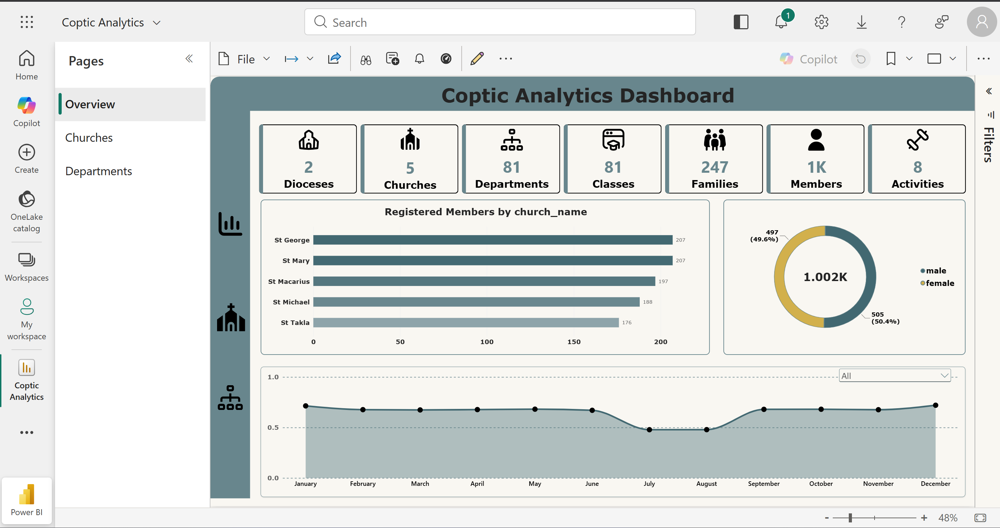
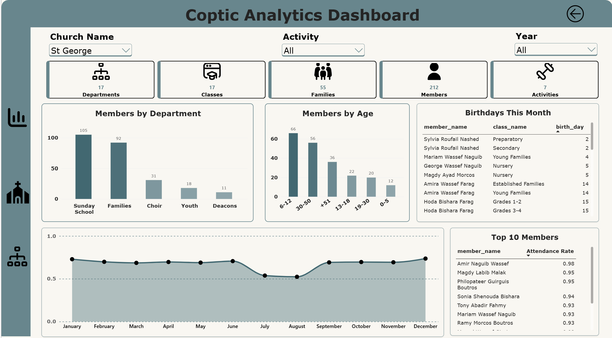
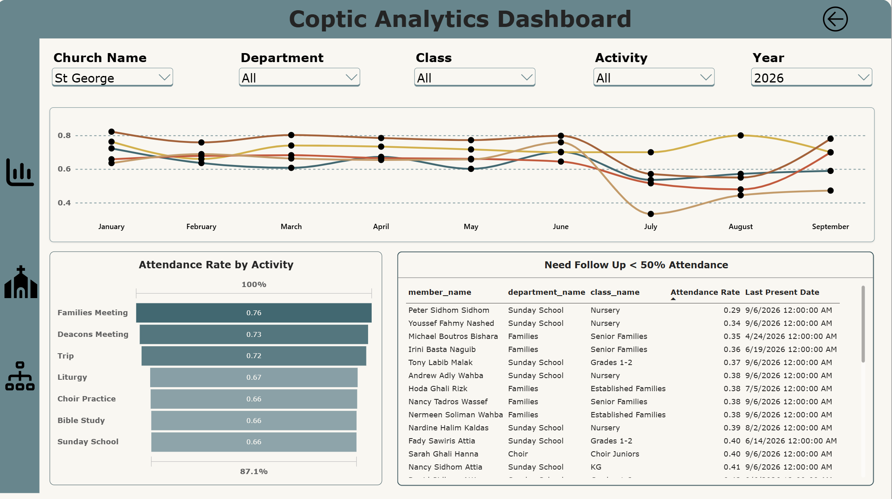

# Coptic Analytics

**Engagement and pastoral-care analytics for Coptic Orthodox dioceses.**



*Power BI dashboard built on a Databricks lakehouse — [see all pages ↓](#power-bi-dashboard)*

> **Note:** All data in this project is synthetic, generated for development
> and testing. The names, families, birthdays and attendance records shown do
> not belong to real people or churches.

---

## Problem

A diocese is an organization like any other. It has a hierarchy, it has
people moving through it, and it has activities it needs to measure — the same
shape as a university with its faculties, departments and enrolled students,
or a hospital with its wards, staff and patient visits. What it does not have
is the tooling. Attendance lives in spreadsheets, one per servant, so nobody
can answer the questions that actually matter: which members have stopped
coming, which class is losing people, and where the drop started.

## Approach

An end-to-end data platform. A PostgreSQL source system captures attendance
with tenant isolation enforced by the database itself, a Databricks medallion
architecture (bronze → silver → gold) cleans and reshapes it into a star
schema, and Power BI serves church- and diocese-level dashboards with
row-level security. The goal is to turn a folder of spreadsheets into a
question-answering system.

## Organization Hierarchy

Diocese → church → department → class, with members enrolled into classes over
dated periods and every access right derived from where a user sits in that
tree. Each level sees its own subtree and nothing above or beside it.


**[Open the interactive version →](https://claude.ai/code/artifact/260d17b7-7cbb-4ba5-ae15-bff72eaca376)**

## Database Design

Fourteen tables in the source schema. `church_id` sits on every table and is
bound into each foreign key as a composite pair, so a row belonging to a
different church cannot be inserted. Nothing is ever hard-deleted.


**[Open the interactive version →](https://claude.ai/code/artifact/8f979101-9a9f-46a9-9bae-c017b24d2ec5)**

## Databricks Lakehouse Flow

The platform follows the medallion architecture, one Unity Catalog
(`coptic_analytics`) with three schemas and Delta tables throughout.
**Bronze** is the raw landing zone — the fourteen source tables ingested
as-is, append-only, with no reshaping. **Silver** cleans and conforms them:
trimmed text, normalised casing, consistent types, one table per source
table. **Gold** reshapes silver into a star schema built for reporting, which
is what Power BI reads.

The source database was designed and built in PostgreSQL and seeded with fake
data. For simplicity and cost, rather than wiring up a live connection, the
tables were exported as CSV files and uploaded to Databricks — so bronze is
fed by fourteen CSVs.


**[Open the interactive version →](https://claude.ai/code/artifact/f118b461-9971-4b35-8abb-20b336fe70d0)**

## Data Model

The gold layer is a star schema: five dimensions — `dim_date`,
`dim_member`, `dim_church`, `dim_class` and `dim_activity` — around a single
factless fact, `fact_attendance`, at the grain of one row per member per
event. `dim_date` is generated rather than sourced, and the dimensions
flatten their parents (diocese into church, department into class, family
into member) so a report never has to join up the hierarchy itself.

Note that not every source table is used here. This is the first version of
the model, scoped to the attendance question; the tables left out (app users,
roles and the selection tables) belong to features the reporting layer does
not answer yet.


**[Open the interactive version →](https://claude.ai/code/artifact/f78ff1f2-c27d-49b5-b1c2-2471168e7805)**

## Power BI Dashboard

The report connects to the gold layer in Databricks using **Import mode**:
the star schema is loaded into the Power BI model, so visuals query the
in-memory copy rather than sending a query to a SQL warehouse on every click.
For a model this size that keeps the report fast and the Databricks compute
cost near zero — the warehouse only runs during a refresh.

After building it in Power BI Desktop, the report was **published to the
Power BI Service**, and the dataset's data source credentials were configured
there to point back at Databricks, so the Service can refresh the imported
data from the gold tables without going through Desktop.

The report has three pages, drilling from the whole organization down to a
single class. Every figure and name in the screenshots comes from the
generated test dataset.

### Overview

Headline counts across every diocese, registered members per church, the
gender split, and the monthly attendance rate.


### Church Level

One church at a time: members by department and age band, birthdays this
month, the attendance trend, and the ten most consistent members.



### Department Level

Filterable down to department, class, activity and year: attendance trend per
department, attendance rate by activity, and a follow-up list of members below
50% attendance with the date they were last present.



### Key DAX Measures

Attendance is counted from `fact_attendance`, one row per member per event.
The attendance rate is `present / (present + absent)` — events not marked yet
are left out, so a late register does not look like a drop in attendance.

```dax
Attendance Rate = DIVIDE ( [Present], [Present] + [Absent] )
```

The report separates people who *attend* from people who are *registered*.
`Members` counts only those who appear in the fact table; `Registered Members`
uses `TREATAS` to apply the church filter directly to `dim_member`, so it
counts everyone currently enrolled, including members who have never
attended.

```dax
Registered Members =
CALCULATE (
    DISTINCTCOUNT ( dim_member[member_id] ),
    TREATAS ( VALUES ( dim_church[church_id] ), dim_member[church_id] ),
    dim_member[is_current_member] = TRUE ()
)
```

**[All measures, why they exist and where they are used →](docs/powerbi_measures.md)**

## License

[MIT](LICENSE).

## About me

I am pursuing a master's in Computational Sciences at the University of
Cologne, Germany, and I am interested in Data Engineering and Analytics —
turning messy data into meaningful insights.
