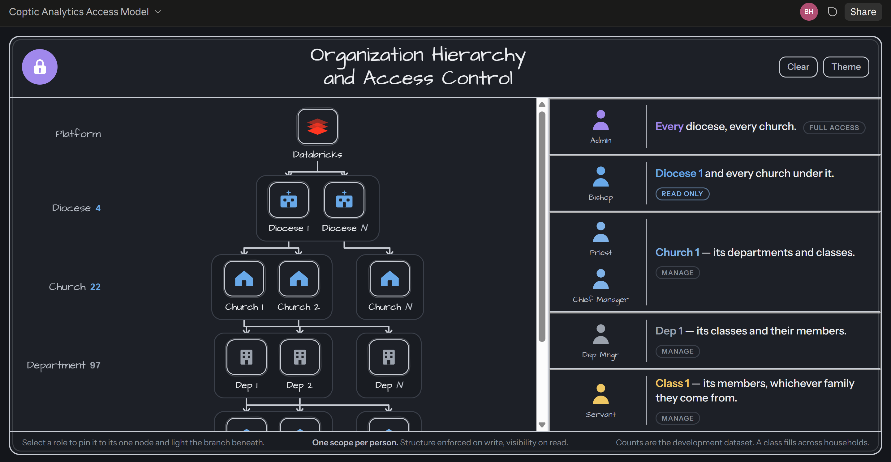
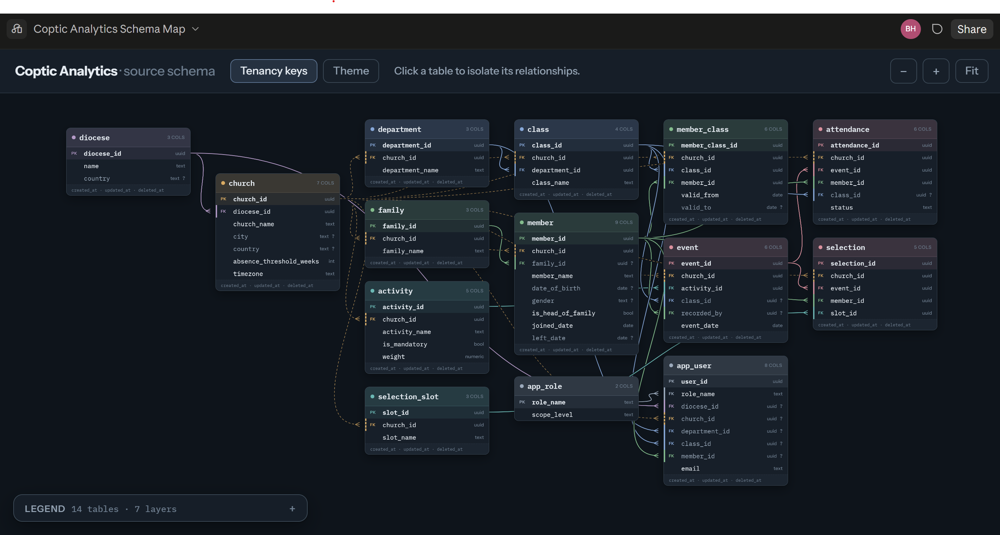

# Coptic Analytics

**Attendance and pastoral-care analytics for Coptic Orthodox dioceses.**

---

## Problem

A diocese is an organization like any other. It has a hierarchy, it has
people moving through it, and it has activities it needs to measure — the same
shape as a university with its faculties, departments and enrolled students,
or a hospital with its wards, staff and patient visits. What it does not have
is the tooling. Attendance lives in spreadsheets, one per servant, so nobody
can answer the questions that actually matter: which members have stopped
coming, which class is losing people, and where the drop started.

## Approach

An end-to-end data platform. A PostgreSQL source system captures attendance
with tenant isolation enforced by the database itself, a Databricks medallion
architecture (bronze → silver → gold) cleans and reshapes it into a star
schema, and Power BI serves church- and diocese-level dashboards with
row-level security. The goal is to turn a folder of spreadsheets into a
question-answering system.

## Organization Hierarchy

Diocese → church → department → class, with members enrolled into classes over
dated periods and every access right derived from where a user sits in that
tree. Each level sees its own subtree and nothing above or beside it.

**[Open the interactive version →](https://claude.ai/code/artifact/260d17b7-7cbb-4ba5-ae15-bff72eaca376)**

## Database Design

Fourteen tables in the source schema. `church_id` sits on every table and is
bound into each foreign key as a composite pair, so a row belonging to a
different church cannot be inserted. Nothing is ever hard-deleted.

**[Open the interactive version →](https://claude.ai/code/artifact/8f979101-9a9f-46a9-9bae-c017b24d2ec5)**

## License

[MIT](LICENSE).

## About me

I am pursuing a master's in Computational Sciences at the University of
Cologne, Germany, and I am interested in Data Engineering and Analytics —
turning messy data into meaningful insights.
